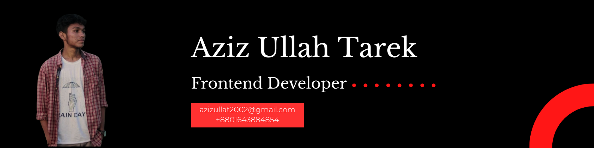

  

<h1 align="center">Hi there, I'm Aziz Ullah Tarek 👋</h1>

  <strong>Frontend Developer | CSE Student | Tech Enthusiast | Problem Solver</strong>

  📍 Dhaka, Bangladesh | 📧 azizullaht2002@gmail.com

  
  
  

---

## 👨‍💻 About Me

I'm a passionate web developer and problem solver who loves exploring new technologies and building impactful solutions. My journey in software development is driven by curiosity and a constant desire to learn and grow. Whether it's crafting elegant user interfaces or solving algorithmic challenges, I'm always up for the challenge.

- 🚀 Currently working on **Next.js and React** projects including a tourism website
- 🌱 Exploring **Next.js, Go, and Golang** for future projects
- 💡 Building expertise in **Machine Learning** to expand my technical horizons
- 🎯 Active problem solver on **Codeforces** and **LeetCode** (specializing in C++)
- 🎨 Designing intuitive interfaces with **Figma** and **Pixso**
- 💻 Experienced with **MySQL** (Workbench, XAMPP) for database management
- 📚 Always curious about exploring new technologies and best practices

---

## 🛠️ Skills & Technologies

### Frontend Development

  
  
  
  
  
  

### Backend & Database

  
  
  
  

### Programming Languages

  
  
  

### Design & Tools

  
  
  
  

---

## 🌐 Connect with Me

  

---

## 📊 GitHub Statistics

  
  
  

  
  
  

  
  

---

## 📌 Pinned Repositories

---

## 💼 What I Bring to the Table

- 🎨 **Frontend Excellence**: Creating responsive, user-friendly interfaces with modern frameworks
- 🧩 **Problem Solving**: Strong analytical skills honed through competitive programming
- 🚀 **Full Stack Capability**: End-to-end development from database design to deployment
- 📱 **Modern Tech Stack**: Proficient in Next.js, React, Node.js, and more
- 🎯 **Continuous Learning**: Always exploring new technologies and staying current with industry trends
- 🤝 **Team Collaboration**: Experience working on collaborative projects and version control

---

## 🎯 Future Roadmap

- 🔥 Master **Go and Golang** for high-performance backend systems
- 🤖 Dive deeper into **Machine Learning** and AI applications
- 🌟 Contribute to **open-source projects** and give back to the community
- 📱 Build production-ready applications that solve real-world problems
- 🏆 Continue improving competitive programming skills on Codeforces and LeetCode

---

  
  ### 💡 "Code is like humor. When you have to explain it, it's bad!" – Cory House
  
  ⭐ Open to freelance opportunities, collaborations, and full-time positions
  
  💬 Feel free to reach out if you want to discuss tech, collaborate on projects, or just chat!

---

  
  
  
  **Thank you for visiting my profile! Let's build something amazing together! 🚀**

